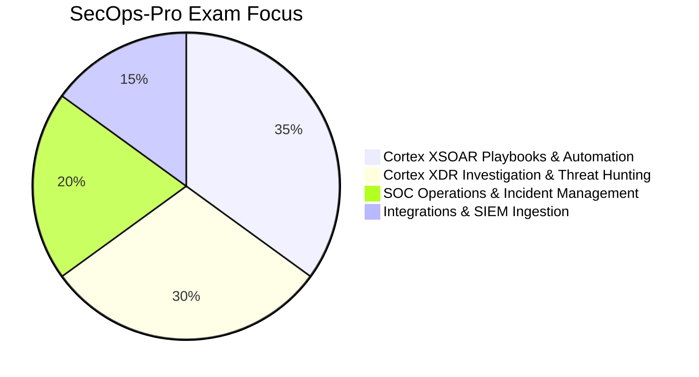

# Palo Alto Networks SecOps-Pro Exam Repository

> **Certification**: SecOps Professional (Palo Alto Networks)

---

## Technical Domain Weights

---

## Technical Domain Matrix

| Focus Domain | Key Technologies | Operational Task |
| :--- | :--- | :--- |
| **SOAR Automation** | Cortex XSOAR, Playbooks, Automation Scripts | Automated Incident Triage & Remediation |
| **XDR Detection** | Cortex XDR, BIOC Rules, Causality Chains | Endpoint & Network Threat Hunting |
| **SOC Operations** | Incident Lifecycle, SLAs, War Room | Incident Investigation & Post-Mortem |
| **Data Ingestion** | Ingestion Brokers, Parsing Rules, XDM | Normalizing Telemetry Streams |

---

## 10 Sample Practice Questions

#### Q1: What is the primary function of Cortex XSOAR in a Security Operations Center (SOC)?
- A) Security Orchestration, Automation, and Response (SOAR) to streamline incident triage and automated playbook execution
- B) Editing office documents
- C) Printing network logs
- D) Managing payroll databases
* **Correct Answer**: A
* **Explanation**: Cortex XSOAR automates security workflows, aggregates incident alerts, and orchestrates remediation tasks across security tools.

#### Q2: What component in Cortex XDR visually maps process execution dependencies to trace attack origin?
- A) Causality View / Causality Chain
- B) Text File Editor
- C) Task Manager
- D) IP Subnet Calculator
* **Correct Answer**: A
* **Explanation**: Causality View constructs process execution trees to illustrate host events, parent-child processes, and network connections.

#### Q3: What is a BIOC rule in Cortex XDR?
- A) Behavioral Indicator of Compromise rule configured to detect malicious process behavior patterns
- B) Basic Input Output Configuration
- C) Backup Index Operating File
- D) Binary Output Code
* **Correct Answer**: A
* **Explanation**: BIOC rules analyze behavioral event sequences on endpoints to identify stealthy threat activity.

#### Q4: In Cortex XSOAR, what is a War Room?
- A) A collaborative incident workspace where analysts investigate events, run CLI commands, and record investigation artifacts
- B) A physical room in a data center
- C) A video game mode
- D) A backup server rack
* **Correct Answer**: A
* **Explanation**: The War Room serves as a real-time collaborative workspace containing full CLI command execution logs for an incident.

#### Q5: Which feature in Cortex XSOAR allows running automated Python or PowerShell scripts during playbook execution?
- A) Automations / Integration Scripts
- B) Windows Batch Files
- C) HTML Templates
- D) Cron Jobs
* **Correct Answer**: A
* **Explanation**: Automations execute custom or out-of-the-box Python/PowerShell scripts within playbook tasks.

#### Q6: How does Cortex XDR perform network threat detection across unmanaged endpoints?
- A) By analyzing network traffic logs collected via Network Modules and Firewall logs (NDR)
- B) By sending emails to all employees
- C) By formatting network switch ports
- D) By disabling DNS servers
* **Correct Answer**: A
* **Explanation**: Cortex XDR ingests network traffic and firewall telemetry to detect anomaly patterns on unmanaged devices.

#### Q7: What is XDM in Cortex XDR?
- A) XDR Data Model used to parse, normalize, and standardize incoming telemetry into a unified schema
- B) eXtended Database Memory
- C) eXternal Disk Module
- D) XML Data Manager
* **Correct Answer**: A
* **Explanation**: XDM normalizes raw log telemetry from diverse vendor sources into standardized fields for correlation.

#### Q8: Which indicator type is managed by Cortex XSOAR TIM (Threat Intelligence Management)?
- A) Hashes, IP addresses, domain names, and URLs (IOCs)
- B) Computer serial numbers
- C) Employee phone numbers
- D) Monitor resolution values
* **Correct Answer**: A
* **Explanation**: TIM aggregates, scores, and deduplicates threat indicators across threat intelligence feeds.

#### Q9: What is the role of a Cortex XSOAR Engine?
- A) Acting as a remote proxy to execute playbooks and integrate with isolated internal networks/DMZs
- B) Generating electrical power
- C) Printing hard copies
- D) Compiling C code
* **Correct Answer**: A
* **Explanation**: Engines enable XSOAR to communicate securely with internal network assets behind firewalls.

#### Q10: How can SOC managers measure incident response efficiency in Cortex XSOAR?
- A) Tracking Mean Time to Detect (MTTD) and Mean Time to Respond (MTTR) metrics on dashboards
- B) Counting mouse clicks
- C) Counting lines of code written
- D) Measuring room noise levels
* **Correct Answer**: A
* **Explanation**: XSOAR dashboards calculate MTTD, MTTR, and SLA compliance metrics to measure SOC team performance.

---

## Preparation Resource

SecOps analysts preparing for the exam can test their incident response knowledge using the [SecOps-Pro exam](https://www.certsclub.com) practice questions to ensure readiness across Cortex XSOAR playbooks and XDR analytics.
